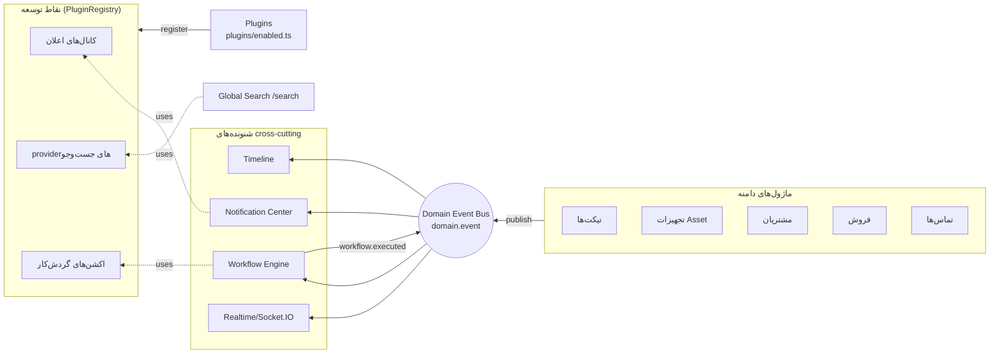
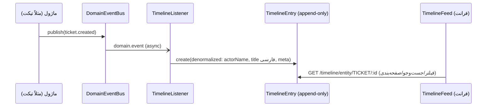
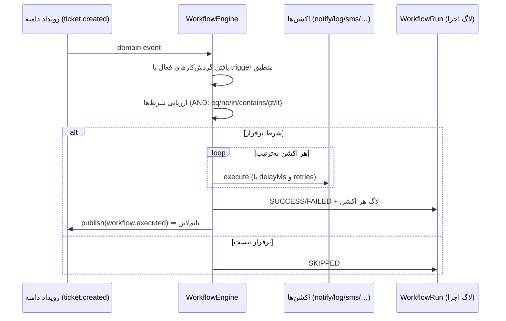
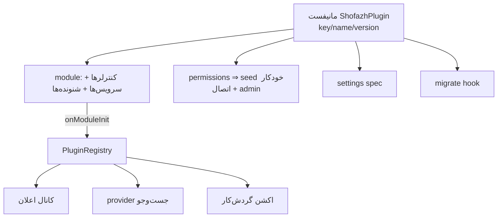
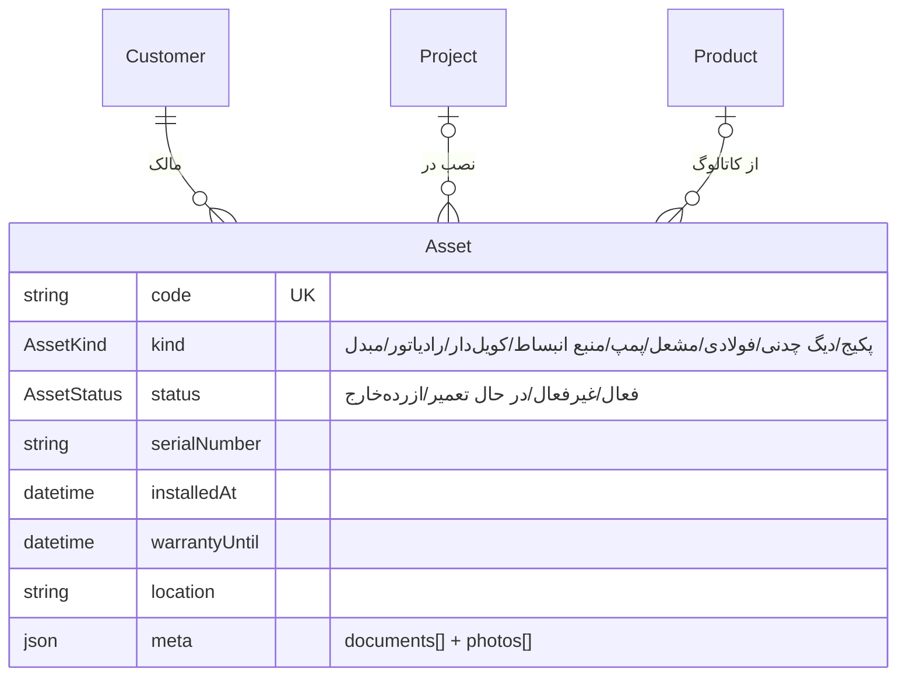

# معماری پلتفرم سازمانی — فاز H7.5

> وضعیت: **اجراشده و اعتبارسنجی‌شده.** این سند معماری هشت قابلیت پلتفرمی را توصیف می‌کند که
> بنیان همه‌ی ماژول‌های سازمانی آینده (نگهداری پیشگیرانه، قرارداد، انبار، گارانتی، …) هستند.

## ۱) نمای کلی معماری

اصل بنیادی: **ماژول‌ها همدیگر را صدا نمی‌زنند؛ رویداد منتشر می‌کنند.** Timeline/اعلان/گردش‌کار/
Realtime شنونده‌اند. افزونه‌ها بدون تغییر هسته، از نقاط توسعه وارد می‌شوند.

## ۲) ناقل رویداد دامنه (جزئیات کامل: `architecture-domain-events.md`)
- `DomainEventBus.publish()` — انتشار دوکاناله (کانال اختصاصی + `domain.event`)، شکست‌ناپذیر.
- پاکت استاندارد: `{name, occurredAt, actorId?, entityType, entityId, title?, payload, correlationId?}`.
- کاتالوگ ۱۹ رویداد نام‌گذاری‌شده با برچسب فارسی (`src/events/event-names.ts`).
- رویدادهای **فعال**: `ticket.*` (۴)، `asset.created/updated`، `workflow.executed`.
- رویدادهای **آماده** (نام + پاکت تعریف‌شده): customer/lead/deal/call/maintenance/invoice/payment/warranty.

## ۳) تایم‌لاین یکپارچه

- **append-only و denormalized** (بدون FK): خواندن سریع، مستقل از حذف موجودیت‌ها.
- فیلتر: `entityType/entityId/eventName/actorId` + جست‌وجوی `q` روی عنوان/شرح + صفحه‌بندی.
- لینک موجودیت مرتبط از `entityType/entityId` ساخته می‌شود؛ پیوست‌ها در `meta`.
- **ماژول‌های آینده هیچ کد تایم‌لاینی نمی‌نویسند** — فقط publish می‌کنند (اثبات: Asset بدون
  حتی یک خط کد تایم‌لاین، در تایم‌لاین ظاهر شد).

## ۴) مرکز اعلان
- `NotificationsService.dispatch()` ⇒ همه‌ی کانال‌های فعال (builtin + افزونه‌ای).
- کانال builtin: **in-app** (ذخیره در جدول + push زنده‌ی `notification:new` به `user:<id>`).
- کانال‌های email/SMS/WhatsApp/push: از طریق قرارداد `INotificationChannel` در افزونه‌ها
  (نمونه‌ی مرجع: `sms-mock`). مرورگر: زنگ اعلان + push سوکت (اعلان مرورگر با همان رویداد).
- پشتیبانی: **اولویت** (LOW/NORMAL/HIGH/URGENT)، **خوانده/نخوانده**، **انقضا** (expiresAt،
  فیلتر خودکار)، **گروه‌بندی** (groupKey)، **قالب/بومی‌سازی** (عنوان/بدنه‌ی فارسی از رویداد؛
  قالب‌های پیشرفته در ماژول گزارش‌گیری).
- API: `GET /notifications` (+unread فیلتر) · `unread-count` · `PATCH :id/read` · `POST read-all`.

## ۵) جست‌وجوی سراسری (Ctrl+K)
- قرارداد `ISearchProvider` + رجیستری: ۷ provider داخلی (مشتری/پروژه/معامله/تیکت/محصول/
  تماس/تجهیز)؛ فاکتور/قرارداد با ماژول خودشان provider اضافه می‌کنند (مثل بقیه، بدون تغییر هسته).
- فارسی، شماره تلفن (تطبیق ارقام)، کد/سریال، تطبیق جزئی، و **رتبه‌بندی** (دقیق=۱۰۰ >
  شروع‌با=۷۰ > شامل=۴۵).
- فرانت: `CommandPalette` با **Ctrl+K** / کلیک نوار جست‌وجو، ناوبری کیبورد، گروه‌بندی نوع.

## ۶) ممیزی سازمانی
- `ActivityLog` با `oldValue/newValue/ip/reason` + فیلتر (نوع/شناسه/عامل/عملیات/بازه‌ی زمانی)
  + **خروجی CSV** (`GET /audit/export`، BOM برای Excel فارسی، فرار امن RFC4180).
- ثبت‌شده‌ها: ورود موفق/ناموفق/قفل حساب (با IP/UA)، حذف موجودیت‌ها، تغییر وضعیت/تخصیص تیکت
  (با old/new). شکست‌ناپذیر (خطای ممیزی جریان اصلی را نمی‌شکند).

## ۷) موتور گردش‌کار

- تعریف در DB (`Workflow`): trigger + شرط‌ها + اکشن‌ها (JSON اعتبارسنجی‌شده با DTO تو در تو).
- **Trigger** هر رویداد دامنه؛ **Condition** روی payload (مسیر نقطه‌ای) و فیلدهای سطح‌بالا؛
  **Action** از registry توسعه‌پذیر؛ **Delay** (delayMs، سقف اجرایی ۱۰s — تأخیر بلند: صف آینده)؛
  **Retry** (retries به‌ازای هر اکشن). ضد حلقه: `workflow.executed` خودش trigger نمی‌شود.
- سناریوی مرجعِ اعتبارسنجی‌شده: «تیکت با اولویت فوری ⇒ اعلان مدیر + پیامک» —
  زنجیره‌ی کامل: دسته‌بند AI («بوی گاز»⇒URGENT) ⇒ شرط ⇒ اکشن‌ها ⇒ اعلان/SMS ⇒ تایم‌لاین.
- **اتوماسیون AI آینده** از همین موتور استفاده می‌کند (اکشن ai-summary به‌عنوان افزونه/اکشن جدید).

## ۸) معماری افزونه

- **نصب = یک خط** در `src/plugins/enabled.ts`؛ هسته تغییری نمی‌کند.
- افزونه عرضه می‌کند: **Routes** (کنترلر داخل module)، **Events** (شنونده/انتشار)، **Services**
  (نقاط توسعه)، **Permissions** (seed idempotent هنگام بوت)، **Settings** (اسکیمای مستند)،
  **Migration hooks** (اجرای idempotent هنگام بوت).
- هدف‌های آینده: ERP، حسابداری، ووکامرس/وردپرس، پیامک واقعی، واتس‌اپ، Issabel، درگاه پرداخت، حمل.
- نمونه‌ی مرجع: `plugins/examples/sms-mock` (همه‌ی نقاط قرارداد را پیاده کرده است).

## ۹) بنیان دارایی (Asset)

- منبع واحد حقیقت تجهیز فیزیکی: نگهداری پیشگیرانه (زمان‌بندی سرویس روی Asset)، گارانتی
  (warrantyUntil)، موجودی/قرارداد — **بدون تکرار اطلاعات تجهیز**.
- «تاریخچه‌ی سرویس» = تایم‌لاین موجودیت ASSET (خودکار از رویدادها) + تیکت‌ها/سرویس‌های مرتبط.
- رویدادهای `asset.created/updated` منتشر می‌شوند؛ جست‌وجوی سراسری سریال/کد/نام را پیدا می‌کند.

## ۱۰) تغییرات ERD (مهاجرت‌های 0006 تا 0009)
| مهاجرت | تغییر |
|---|---|
| 0006 | `TimelineEntry` (جدید) · `Notification` + priority/groupKey/link/expiresAt · `ActivityLog` + oldValue/newValue/ip/reason · enum `NotificationPriority` |
| 0007 | `Asset` (جدید) + enums `AssetKind`/`AssetStatus` + FK به Customer/Project/Product |
| 0008 | `EntityType` += `ASSET` |
| 0009 | `Workflow` + `WorkflowRun` (جدید) + enum `WorkflowRunStatus` |

همه افزودنی؛ هیچ جدول/ستون موجودی تغییر یا حذف نشد (سازگاری کامل عقب‌رو).

## ۱۱) الگوی اتصال ماژول‌های آینده (مثال: نگهداری پیشگیرانه)
1. مدل + CRUD خودش را می‌سازد (روی **Asset**).
2. `events.publish({name: DomainEvents.MaintenanceScheduled, …})` ⇒ تایم‌لاین/اعلان/گردش‌کار
   **خودکار** فعال می‌شوند.
3. یک `ISearchProvider` ثبت می‌کند ⇒ در Ctrl+K ظاهر می‌شود.
4. عملیات حساس را `audit.record()` می‌کند.
5. اگر یکپارچگی خارجی دارد ⇒ افزونه.
